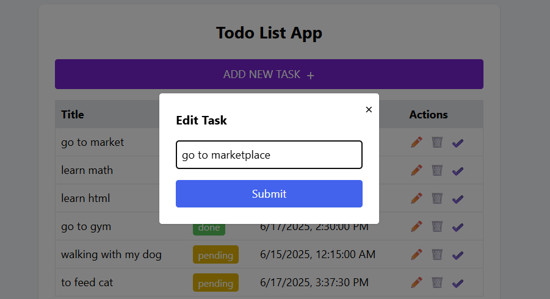

# Mini Task Manager

This is a simple full-stack task manager built using **Next.js**, **Tailwind CSS**, and a mock backend API. Users can view, add, update, and delete tasks through a clean and responsive user interface.

---

## API Documentation

### Base URL
```http://localhost:3001```


### Endpoints

| Method | Endpoint         | Description            |
|--------|------------------|------------------------|
| GET    | `/tasks`         | Get all tasks          |
| POST   | `/tasks`         | Create a new task      |
| GET    | `/tasks/:id`     | Get a task by ID       |
| PUT    | `/tasks/:id`     | Update a task          |
| DELETE | `/tasks/:id`     | Delete a task          |

### Sample Input for POST

```json
{
  "title": "Buy groceries",
  "status": "pending"
}
```
### Sample Output
```json
{
  "id": "1",
  "title": "Buy groceries",
  "status": "pending",
  "createdAt": "2025-06-17T10:00:00Z"
}
```

## Project Structure
The project is kept in one codebase (monorepo), but the frontend and backend run separately.
The frontend is built with Next.js. It fetches data using the API.
The backend is a simple server (for example, using Express.js) that handles all task data using mock JSON.

## How to run locally
- Clone the repository
- Install dependencies with npm install
- Run the json server with this command "json-server --watch data/todos.json --port 3001"
- Run the development server with npm run dev
- Navigate to http://localhost:3000 in your web browser


# Section B: Explanation
### 1.Why did you choose this project structure?
I chose a simple structure that keeps both the frontend and backend in one place (a monorepo). This makes it easy to manage everything in a single project. Since the backend is just a small mock API, it’s easier to keep it nearby and run both parts locally and seperately.

### 2.How did you separate frontend and backend concerns?
Although they are in the same repo, the frontend and backend are separate as mentioned above. The backend handles API requests and serves task data. The frontend uses fetch() to call those API endpoints and show the results to the user. This separation makes the app easier to maintain.

### 3.How would you handle errors and edge cases?
In the frontend, I use try/catch blocks to catch errors during API calls. If there’s a problem (like an empty title or trying to update a non-existing task), the app can show a message instead of crashing. The backend also returns proper error responses if something goes wrong.

### 4.What security features would you add in production?
For real users - 
Add authentication.
Sanitize all inputs to avoid bad data or scripts
Use HTTPS to keep the connection secure
Add CORS settings to control who can access the API

### 5. What would you improve if you had one more day?
Use a real database instead of mock data
Improve the user interface and design
Add features like filters, search, and loading indicators
Deploy the project so it's accessible online

## Screenshots

### 1. App Initialization


### 2. Adding a New Task


### 3. Editing an Existing Task


### 4. All Tasks Marked Done


